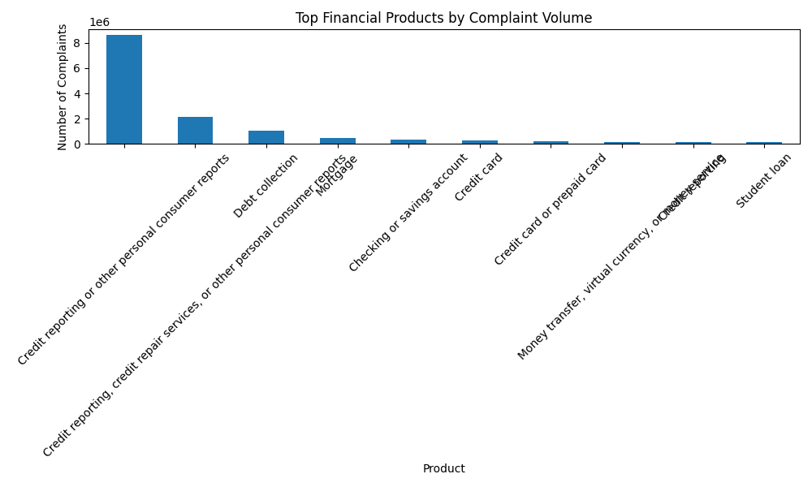
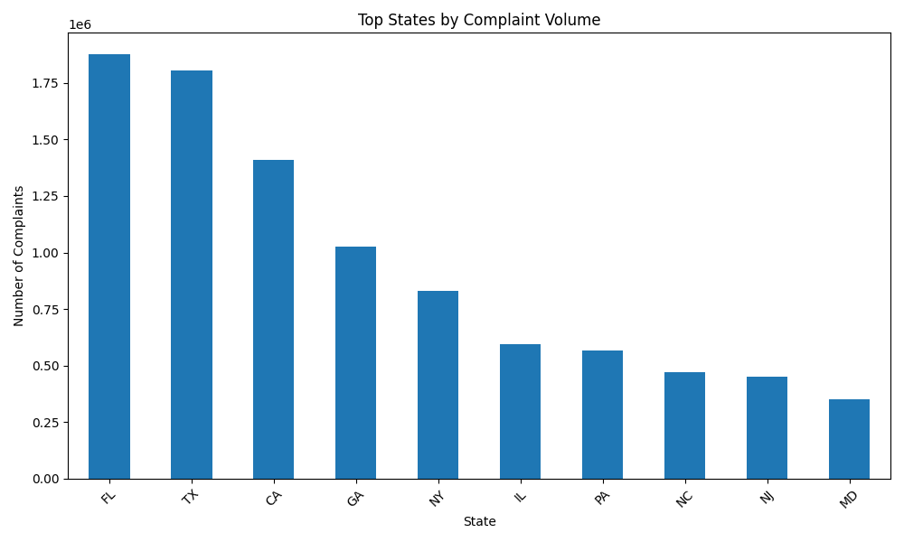
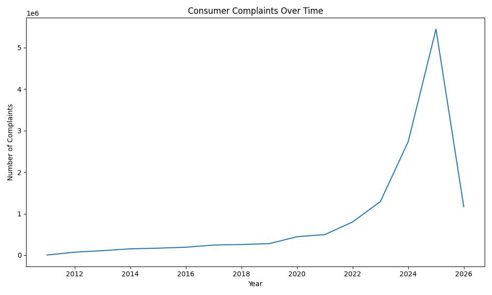

# Financial Consumer Complaint Trend Analysis

## Key Insights

This analysis explored over 13 million consumer financial complaints from the U.S. Consumer Financial Protection Bureau dataset.

Key findings include:

• Credit reporting issues dominate complaint volumes, representing the majority of reported consumer disputes.

• Florida, Texas, and California report the highest complaint volumes, suggesting geographic concentration in consumer financial disputes.

• Complaint volumes have grown dramatically since 2020, increasing from roughly 444,000 complaints to over 5 million in 2025.

• The growth in complaint reporting may reflect increased regulatory awareness, consumer engagement, and financial service complexity.

---

## Project Overview

This project analyses consumer financial complaint data to identify trends, geographic patterns, and common financial product issues. The goal was to explore how large public datasets can be used to generate insights into consumer financial challenges.

The analysis was conducted using Python and pandas to process a dataset of over 13 million complaints.

---

## Tools Used

Python  
Pandas  
Visual Studio Code  
Public dataset from the Consumer Financial Protection Bureau (CFPB)

---

## Dataset

Source: Consumer Financial Protection Bureau Consumer Complaint Database

The dataset contains over 23 million complaint records across multiple financial products including credit reporting, mortgages, credit cards, and debt collection.

For analysis, a cleaned subset of approximately 13.8 million rows was generated.

---

## Analysis Questions

1. Which financial products receive the most consumer complaints?

2. Which states report the highest complaint volumes?

3. How have complaint volumes changed over time?

4. What financial issues appear most frequently across products?

---

## Conclusion

This analysis demonstrates how large public datasets can be used to identify patterns in consumer financial issues. The results highlight the dominance of credit reporting complaints and the rapid growth of complaint reporting in recent years.
## Possible Drivers of Complaint Growth

Several factors may explain the sharp increase in complaints after 2020:

• Increased consumer awareness of the CFPB complaint platform during the COVID-19 pandemic.

• Greater digital engagement with financial services, increasing exposure to credit reporting and banking disputes.

• Expansion of credit reporting disputes related to identity theft and fraud.

• Increased regulatory visibility and media attention encouraging consumers to file formal complaints.

While this analysis focuses on complaint trends, further work could explore relationships between economic conditions and complaint volumes.
## Limitations of the Analysis

This analysis focuses on complaint volumes rather than complaint severity.

Several limitations should be considered:

• Complaint volumes may reflect increased awareness of reporting systems rather than worsening financial services.

• Larger states naturally generate more complaints due to population size.

• The dataset contains reported complaints rather than verified regulatory violations.

Future work could normalise complaints by state population and explore company-level complaint patterns.
## Visual Analysis

### Complaints by Product

### Complaints by State

### Complaint Trends Over Time

